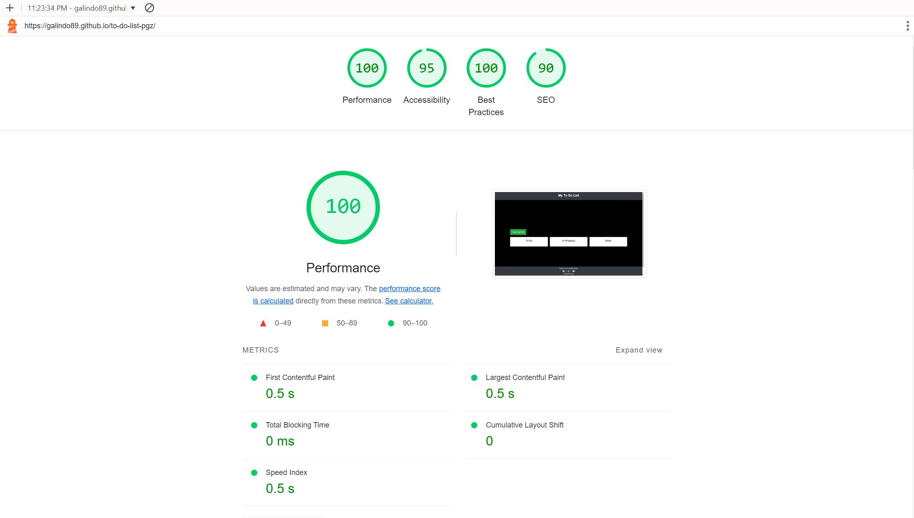

# To-Do List Application

Visit the deployed site: [To-Do List App](https://galindo89.github.io/to-do-list-pgz/)

A web-based To-Do List application designed to help users manage their tasks efficiently. The application features task creation, editing, status tracking, and due date management, with a responsive design for use across various devices.

## CONTENTS

- [To-Do List Application](#to-do-list-application)
  - [CONTENTS](#contents)
  - [Introduction](#introduction)
    - [Purpose of the project](#purpose-of-the-project)
  - [User Experience (UX)](#user-experience-ux)
    - [User Stories](#user-stories)
  - [Design](#design)
    - [Colour Scheme](#colour-scheme)
    - [Typography](#typography)
    - [Imagery](#imagery)
    - [Wireframes](#wireframes)
    - [Features](#features)
      - [Main Interface](#main-interface)
      - [Task Management](#task-management)
      - [Responsive Design](#responsive-design)
      - [Future Implementations](#future-implementations)
  - [Technologies Used](#technologies-used)
    - [Languages Used](#languages-used)
    - [Frameworks, Libraries \& Programs Used](#frameworks-libraries--programs-used)
  - [Deployment \& Local Development](#deployment--local-development)
    - [Deployment](#deployment)
    - [Local Development](#local-development)
      - [How to Fork](#how-to-fork)
      - [How to Clone](#how-to-clone)
  - [Testing](#testing)
    - [Feature Testing](#feature-testing)
    - [Browser Compatibility](#browser-compatibility)
    - [Responsiveness Testing](#responsiveness-testing)
    - [Code Validation](#code-validation)
      - [HTML](#html)
      - [CSS](#css)
      - [JavaScript](#javascript)
    - [Lighthouse Testing](#lighthouse-testing)
    - [Bugs Documentation](#bugs-documentation)
    - [Solved Bugs](#solved-bugs)
    - [Known Bugs](#known-bugs)
  - [Credits](#credits)
    - [Code Used](#code-used)
    - [Final Declaration of authenticity and credit](#final-declaration-of-authenticity-and-credit)
    - [Media](#media)
    - [Acknowledgments](#acknowledgments)
    - [Contact](#contact)

## Introduction
### Purpose of the project
The purpose of this project is to create a To-Do List application that allows users to manage their tasks efficiently. The application provides functionalities to add, edit, delete, and track the status of tasks, with features like due date management and task categorization.

The main objective is to provide a simple, user-friendly interface that works seamlessly across all devices, ensuring users can manage their tasks from anywhere, at any time.

## User Experience (UX)
### User Stories
- As a user, I want to add tasks to my to-do list, so that I can keep track of what needs to be done.
- As a user, I want to edit existing tasks, so that I can update their details as needed.
- As a user, I want to set due dates for tasks, so that I can manage deadlines effectively.
- As a user, I want to track the status of tasks (To-Do, In Progress, Done), so that I can monitor my progress.
- As a user, I want to access the application on multiple devices (desktop, tablet, mobile), so that I can manage my tasks on the go.
- As a user, I want to be able to locally store my tasks in the browser using local storage, so that my tasks are saved even when I close and reopen the browser.

## Design
### Colour Scheme
The color scheme was chosen to create a professional and organized appearance, ensuring the user interface is clear and easy to navigate.

- **Primary Colors:**
  - **Background Image:** Black with stars.
  - **Header and Footer Background:** `#343a40` (Dark Gray)
  - **Body Background (Fallback):** `#000000` (Black)
- **Text Colors:**
  - **Primary Text Color:** `#ffffff` (White) - Used for header and footer text.
  - **Body Text Color:** `#333333` (Dark Gray)
- **Button Colors:**
  - **Primary Button Background:** `#28a745` (Green)
  - **Primary Button Hover Background:** `#218838` (Darker Green)
- **List Item Background:**
  - **List Items:** `#f9f9f9` (Light Gray)
- **Due Date Based Colors:**
  - **Tasks Due in More Than a Week:** `ligthcoral` (Light Coral)
  - **Tasks Due in 2-7 Days:** `ligthsalmon` (Light Salmon Orange)
  - **Tasks Due in Less Than 2 Days:** `lightgreen` (Light Green)
- **Borders and Miscellaneous:**
  - **Modal Background:** `rgba(0, 0, 0, 0.4)` (Semi-transparent Black)
  - **Modal Content Background:** `#ffffff` (White)
  - **Modal Content Border:** `#888888` (Gray)
  - **Input Border:** `#cccccc` (Light Gray)
  - **Close Button Color:** `#aaaaaa` (Gray)
  - **Delete Task Icon Hover Color:** `#dc3545` (Red)
  - **Footer Links Hover Color:** `#f9f9f9` (Light Gray)

### Typography
For typography, a clean and modern font was chosen to ensure readability and a professional look.

- 'Roboto', sans-serif for all text, providing a modern and clean appearance.

### Imagery
Imagery is minimal to maintain focus on task management. The background is a subtle space-themed image that provides a visually appealing backdrop without distracting from the content.

### Wireframes
Wireframes were created to plan the layout and user flow for the application. Below are examples of the wireframes for different devices:

### Features
The application is designed to be intuitive and efficient, providing users with all the tools they need to manage their tasks.

#### Main Interface
The main interface displays tasks organized into three columns: To-Do, In Progress, and Done. Users can easily move tasks between these columns by updating their status.

#### Task Management
Tasks can be added, edited, and deleted. Each task includes a description, due date, and status. The status can be updated by clicking on the task, and the task's appearance changes based on its due date to help users prioritize.

#### Responsive Design
The application is fully responsive, ensuring a consistent experience across all devices, whether on a desktop, tablet, or mobile device.

#### Future Implementations
Future enhancements may include:

1. Adding priority levels to tasks for better management.
2. Implementing drag-and-drop functionality for moving tasks between columns.
3. Adding user authentication to allow for personalized task lists.

## Technologies Used

### Languages Used
- HTML5
- CSS3
- JavaScript

### Frameworks, Libraries & Programs Used
- [Git](https://git-scm.com/) - For version control.
- [GitHub](https://github.com/) - To host and deploy the website.
- [Google Fonts](https://fonts.google.com/) - To import the 'Roboto' font.
- [Font Awesome](https://fontawesome.com/) - For icons used in the application.
- [Multi Device Website Mockup Generator](https://techsini.com/multi-mockup/index.php) - For creating mockups of the application across devices.

## Deployment & Local Development

### Deployment
The site is deployed using GitHub Pages: [To-Do List App](https://your-deployed-url.com).

To deploy the site using GitHub Pages:

1. Log in to GitHub.
2. Go to the repository for this project.
3. Click the settings button.
4. Select pages in the left-hand navigation menu.
5. From the source dropdown, select the main branch and press save.

### Local Development

#### How to Fork
To fork the repository:

1. Log in to GitHub.
2. Go to the repository for this project.
3. Click the Fork button in the top right corner.

#### How to Clone
To clone the repository:

1. Log in to GitHub.
2. Go to the repository for this project.
3. Click on the code button, select whether you would like to clone with HTTPS, SSH, or GitHub CLI, and copy the link shown.
4. Open the terminal in your code editor and change the current working directory to the location you want to use for the cloned directory.
5. Type 'git clone' into the terminal and then paste the link you copied in step 3. Press enter.

## Testing
### Feature Testing
Comprehensive testing was conducted to ensure that all features function as expected. Each feature was tested on multiple devices and browsers to verify compatibility and responsiveness.

| Feature                | Page  | Scenario                                                           | Steps                                             | Expected result                                                                                                                                                       | Result |
|------------------------|-------|--------------------------------------------------------------------|---------------------------------------------------|-----------------------------------------------------------------------------------------------------------------------------------------------------------------------|--------|
| Open Modal             | Main  | User clicks "Create New Task" button                               | Click the "Create New Task" button                | A modal opens where the user can input task details including task name, due date, and status.                                                                        | Passed |
| Add Task               | Main  | User adds a new task                                               | Click "Add Task", enter details, and save         | Task appears in the To-Do column with the correct details.                                                                                                             | Passed |
| Edit Task              | Main  | User edits an existing task                                        | Click on a task, update details, and save         | Task updates with new details without creating duplicates.                                                                                                             | Passed |
| Delete Task            | Main  | User deletes a task                                                | Click the delete icon on a task                   | Task is removed from the list.                                                                                                                                         | Passed |
| Change Status          | Main  | User changes the status of a task                                  | Click on a task's status                          | Task moves to the correct column (To-Do, In Progress, Done) based on the selected status.                                                                              | Passed |
| Due Date Color Change  | Main  | Task color changes based on due date                               | Add tasks with varying due dates                  | Tasks due in more than a week should have a light green background, tasks due in 2-7 days should have a light orange background, and tasks due in less than 2 days should have a light red background. | Passed |
| Local Storage Save     | Main  | Tasks are saved in local storage                                   | Add tasks, refresh the page, and check local storage | After refreshing the page, the tasks should still be present as they are retrieved from local storage.                                                                  | Passed |
| Responsive Design      | All   | User accesses the site on different devices                        | Resize browser or test on different devices       | The layout adjusts appropriately for desktop, tablet, and mobile views.                                                                                                | Passed |

### Browser Compatibility
The project was tested across several modern browsers with no issues found.

| Browser tested | Appearance | Responsiveness | Comment         |
| -------------- | ---------- | -------------- | --------------- |
| Chrome         | Good       | Good           | No issues found |
| Firefox        | Good       | Good           | No issues found |
| Edge           | Good       | Good           | No issues found |

### Responsiveness Testing
The application was tested on various devices to ensure responsiveness.

| Device tested  | Site responsiveness <= 767px                     | Site responsiveness 768px <= x <= 991px | Site responsiveness x >= 992px            |
| -------------- | ------------------------------------------------ | --------------------------------------- | ---------------------------------------- |
| Google Pixel 7 | Good. All pages rendered correctly                | N/A                                     | N/A                                      |
| iPad Mini      | N/A                                              | Good. All pages rendered correctly      | N/A                                      |
| Desktop        | N/A                                              | N/A                                     | Good. All pages rendered correctly       |

### Code Validation
#### HTML
HTML code validation was conducted using the [W3C Markup Validation Service](https://validator.w3.org/).

| Page Tested | Errors                                                                                                         | Solutions applied?                                        | Screenshot of clear validator output                                |
| ----------- | -------------------------------------------------------------------------------------------------------------- | --------------------------------------------------------- | ------------------------------------------------------------------- |
| index.html  |None ||  |

#### CSS
CSS code was validated using the [W3C CSS Validation Service](https://jigsaw.w3.org/css-validator/validator).

| File      | Errors                                                                 | Solutions applied?                               | Screenshot of clear validator output                              |
| --------- | ---------------------------------------------------------------------- | ------------------------------------------------ | ----------------------------------------------------------------- |
| style.css |None ||   |

#### JavaScript
CSS code was validated using the [JSHiint JavaScript online validation tool](https://jshint.com/).

| File      | Errors                                                                 | Solutions applied?                               | Screenshot of clear validator output                              |
| --------- | ---------------------------------------------------------------------- | ------------------------------------------------ | ----------------------------------------------------------------- |
| initializeApp.js | No errors identified by JSHint during the validation of the js code. ||   |
| storage.js | No errors identified by JSHint during the validation of the js code. ||  |
| taskManager.js | No errors identified by JSHint during the validation of the js code. ||  |
| utils.js | No errors identified by JSHint during the validation of the js code. ||  |

### Lighthouse Testing
Lighthouse testing was conducted using Chrome's developer tools to assess performance, accessibility, SEO, and best practices.

- Mobile results: 
- Desktop results: 

### Bugs Documentation
During development and testing, several bugs were identified and resolved. The table below outlines the bugs and their resolutions.

| Bug                                                        | Solution                                                                                  | Status             |
| ---------------------------------------------------------- | ----------------------------------------------------------------------------------------- | ------------------ |
| Modal not closing when clicking outside                    | Added event listener to close the modal when clicking outside the modal content.          | Fixed and deployed |
| Task color not updating after changing due date            | Updated the logic to reapply color coding based on the new due date after editing a task. | Fixed and deployed |
| Task status not saving in local storage after change       | Corrected the save logic to ensure status updates are reflected in local storage.         | Fixed and deployed |
| When changing status, the select dropdown remains active in Firefox browser | Updated event listeners and functions to properly deactivate the select dropdown after the "click" event. | Fixed and deployed |

### Solved Bugs
See above.

### Known Bugs
There are currently no known bugs. All identified issues have been resolved as of the last update.

## Credits
### Code Used
The code for this project was developed by the author, with inspiration from various online tutorials and resources. Key concepts were drawn from:

1. Flexbox layout guides.
2. JavaScript task management examples.
3. CSS styling tips for responsive design.
4. JSDoc for documenting the js functions.
5. MDN Web Docs for arrow functions and using local storage.

### Final Declaration of authenticity and credit
I declare that this README and the associated code are my original work. Any references to external sources have been properly credited.

### Media
Background image sourced from a generated image via [DALL·E](https://openai.com/dall-e).  
Icons sourced from Font Awesome.  
Favicon generated via [WEBWIZARD](https://webwizard.ie/favicon/from-text/).

### Acknowledgments

1. Thanks to my tutor for their guidance throughout this project.
2. Gratitude to the Code Institute community for their support and helpful resources.
3. Special thanks to [Slaying The Dragon](https://www.youtube.com/@slayingthedragon) for their excellent CSS tutorials, which were instrumental in developing this project.
4. Thanks to W3Schools for their tutorial on creating a modal. For more information, check this [link](https://www.w3schools.com/howto/howto_css_modals.asp).
5. Thanks to Stack Overflow for helping me solve several issues I faced during the implementation. For example, they helped me figure out how to implement the function to calculate the days left. For more information, check this [link](https://stackoverflow.com/questions/35987262/difference-in-days-between-two-days-in-yyyy-mm-dd-format).

   
### Contact
For more information, please contact [pablo.galindozapata@gmail.com].
